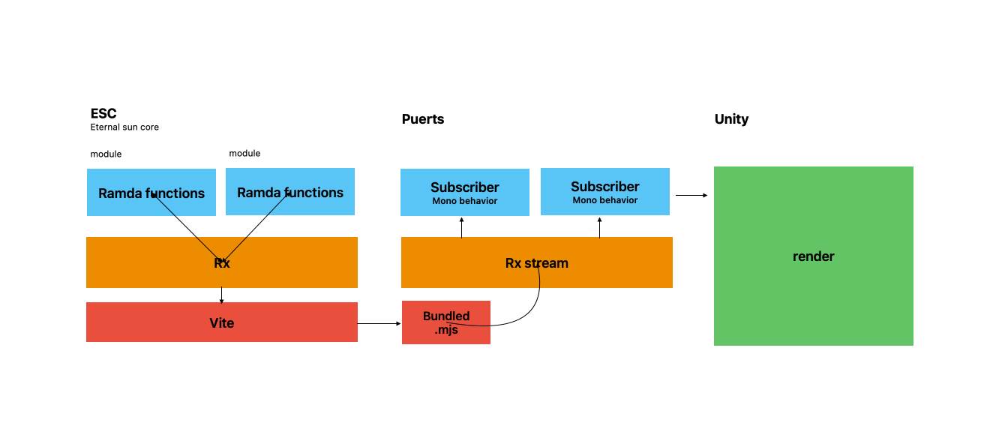

# Eternal Sun Core

## 通过一个独立的 JS 核心控制全部游戏逻辑

将所有游戏逻辑拆分为若干个模块。  
每个模块最终都产出一个纯函数，可以接受输入或者输出。  
输入输出由 rxjs 控制，最终核心控制器要对外暴露若干个 rxjs 流，供外部订阅。  
还需要暴露一个 step 函数，用于推进游戏进程。

## 如果宿主不是 Cocoscreator

### 如果宿主是 Unity

使用 Puerts 运行核心，可能在场景中需要建立一个空的 GameObject，用于运行核心。并关联所有场景中物体。  
在此 GameObject 的 mono behavior 上，需要根据发送过来的 stream 动态创建特定的脚本，用于在特定 GameObject 上处理 stream。同时在 update 函数中运行 step 函数。  
所谓处理 Stream 就是把其中的数据，转化为 unity 渲染代码。
